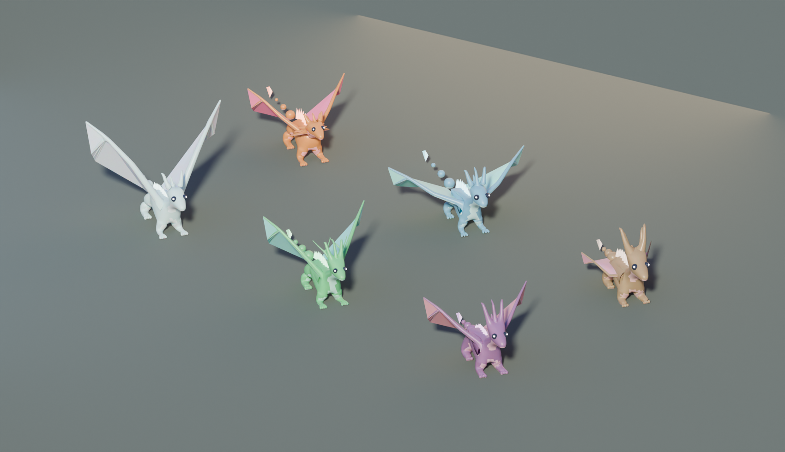
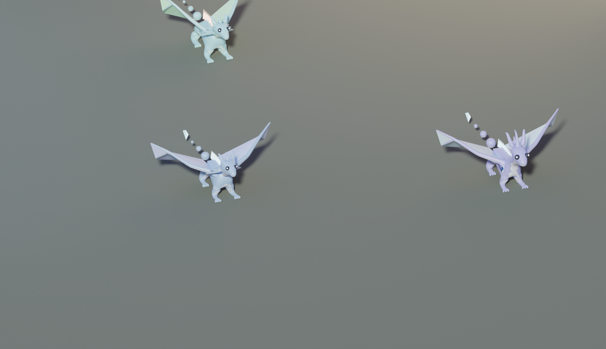

# DRAGONVEIN · Long Mạch

Game nhập vai 3D chạy thẳng trên trình duyệt: khám phá thế giới đảo bay, thuần hoá rồng
hoang, cưỡi rồng bay giữa các đảo, và xây đảo nhà của riêng mình.

**Điểm khác biệt:** lai giống **sinh ra mesh 3D thật sự mới**.

Gen của con rồng *chính là* bộ tham số dựng mesh của nó — số sừng, sải cánh, độ cong cổ,
khối lượng thân, kiểu mào, sắc vảy. Lai hai con rồng ra một con rồng chưa từng tồn tại,
không phải đổi màu một model có sẵn.

> "Nhìn con này đi. Không ai có con giống vậy."



Sáu nguyên tố — ember, tide, stone, gale, jade, umbra — mỗi nguyên tố lệch hình bóng theo
một hướng riêng: gale cánh rộng thân nhẹ, stone nặng nề cánh ngắn có gạc, ember nhiều sừng
và màu bão hoà. Tất cả đều sinh ra từ **một** generator.



## Bắt đầu từ đâu

| file | nội dung |
|---|---|
| [`NEXT.md`](NEXT.md) | **việc cần làm ngay** — một màn hình, mỗi lần chạy viết lại |
| [`docs/OPERATIONS.md`](docs/OPERATIONS.md) | cách dự án tự vận hành, và cách dựng lại từ số không |
| [`STATE.md`](STATE.md) | nhật ký từng lần chạy — giải thích *tại sao* |
| [`CLAUDE.md`](CLAUDE.md) | hợp đồng mà mọi lần chạy phải tuân theo |

## Trạng thái

Mới ở bước dựng khung. Xem [`docs/ROADMAP.md`](docs/ROADMAP.md) để biết đang làm tới đâu,
và [`STATE.md`](STATE.md) để xem lần chạy gần nhất làm được gì.

## Công nghệ

| phần | chọn gì | vì sao |
|---|---|---|
| Runtime | TypeScript + Three.js + Vite | chạy từ một đường link, không cài đặt — quan trọng với người chơi trẻ |
| Mesh lúc chạy | TS trong Web Worker | rồng lai chưa có mesh cho tới đúng lúc được lai ra |
| Asset tác giả | Python + Blender (`bpy`) | script là nguồn sự thật, không có file `.blend`, agent chỉnh lại được |
| Render duyệt asset | Cycles trên CPU | gate mọi asset bằng một ảnh render — asset chưa ai nhìn là asset chưa xong |
| Lưu | IndexedDB | offline, không tài khoản, không backend |
| Triển khai | GitHub Pages | mở bằng link trên bất kỳ máy nào |

Ngân sách: 16.6 ms p95 ở 1080p Medium, ≤ 180 draw call, bundle ≤ 1.4 MB gzip.
Năm bậc chất lượng từ Potato (720p, 30 fps, máy không GPU rời) tới Ultra.

## Chạy thử

```sh
npm install
npm run dev          # http://localhost:5173
npm run gates        # toàn bộ hàng rào chất lượng
```

Pipeline asset (cần Python 3.13):

```sh
pip install bpy
export LIBGL_ALWAYS_SOFTWARE=1
python3 -I assetgen/render_proof.py
```

## Cách dự án này được xây

Mỗi ngày hai lần, một phiên Claude tự chạy theo hợp đồng trong [`CLAUDE.md`](CLAUDE.md):
lấy milestone chưa xong thấp nhất, chia việc cho các agent mỗi agent sở hữu đúng một thư
mục, chạy toàn bộ gate, rồi đưa kết quả cho ba critic **chấm trong ngữ cảnh sạch** — chỉ
nhìn ảnh render, số đo và log, không nhìn lý lẽ của người build. Dưới 8.0 thì sửa, tối đa
3 vòng.

Tài liệu nền:
[CLAUDE.md](CLAUDE.md) ·
[ASSET_PLAN](docs/ASSET_PLAN.md) ·
[GENOME](docs/GENOME.md) ·
[ARCHITECTURE](docs/ARCHITECTURE.md) ·
[RUBRIC](docs/RUBRIC.md) ·
[ROADMAP](docs/ROADMAP.md) ·
[GDD](docs/GDD.md) ·
[ART_BIBLE](docs/ART_BIBLE.md)
